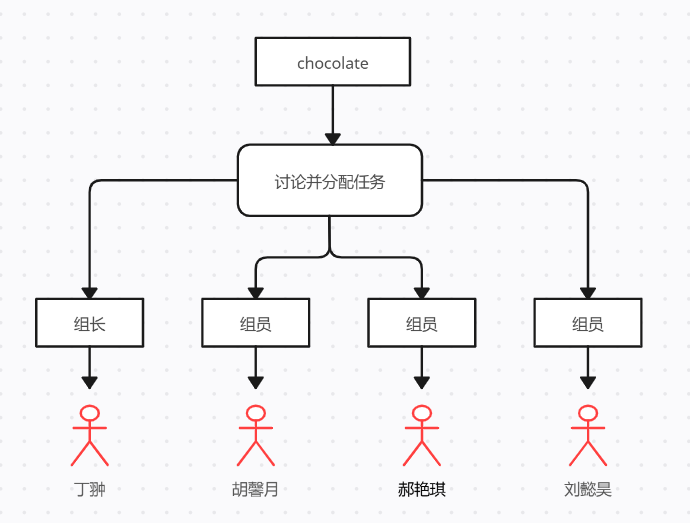

### Brainstorm——流模型、HMW、人物角色和故事板

#### 流模型

#### HWM

本项目旨在搭建“校园食堂便利、安全与多样性反馈评价体系”，通过已有平台或新搭建平台，为师生提供**完整上传反馈信息——相关方接收处理问题——反馈确认评价**，三步走服务，为协助提升校园食堂**餐饮质量**、**服务水平**、**信息透明**以及**名誉形象**做师生与服务提供方的对接工作。

为完成上述目标，需要提前对界面进行UI设计、功能设计等，故此，进行全方面的、多角度的、多层次的思辨是重要的准备工作。

HMW（How Might We ... ?）：

1. **HMW**使这款小程序/功能板块触手可及，从而被大家轻松接受？
2. **HMW**保证反馈信息准确有效，避免谩骂、不知所云式的反馈？
3. **HMW**保证具有时效性要求的反馈能够被及时看到，得到处理？
4. **HMW**保证能够实行信息公开，监督反馈后措施？
5. **HMW**对不能提供正当理由解释的处理方式、结果，进行进一步投诉？
6. **HMW**对处理方式、结果令人满意的事项进行肯定，使其更愿意听取建议并积极改进，形成正循环？
7. **HMW**进行持续更新，以应对可能出现的新内容、必须推出的新板块？

上述7项HWM内容。

#### 人物角色

#### 故事板

#### 重新审视问题

对于HMW中提到的7项内容，经过本组讨论后得到以下可行的解决途径：

1. HMW使这款小程序/功能板块触手可及，从而被大家轻松接受？

   **解决途径**：依赖现有的、被广泛安装、使用的软件，在依托其平台，开发小程序或应用板块。在此基础上，通过校内官方渠道进行宣传，鼓励食堂方和学生方进行对接、使用。

2. HMW保证反馈信息准确有效，避免谩骂、不知所云式的反馈？

   **解决途径**：建立分类和筛选机制。分类机制，指将后勤保障中的食堂区单独划分出来，按楼层划分等方式，确保“层层有人负责，天天有人监督”，建立责任区。筛选机制，指通过技术手段，对可能出现的表示谩骂的词汇进行屏蔽，也就是设置敏感词，只要有敏感词在特定句式下被使用，则不能完成提交、评价等操作。

3. HMW保证具有时效性要求的反馈能够被及时看到，得到处理？

   **解决途径**：建立筛选和自选机制。筛选机制，根据关键词，如“刚才”、“刚”、“现在”等词汇，确定正在发生的、需要被立刻处理的反馈，提高其权重，首先被推送到负责人处。自选机制，反馈人自行判断，选择期待的解决时间。

4. HMW保证能够实行信息公开，监督反馈后措施？

   **解决途径**：在每一条反馈被提交处理后，由当事人和评价团（各占比50%），对处理态度、时间、结果等进行反馈评分。

5. HMW对不能提供正当理由解释的处理方式、结果，进行进一步投诉？

   **解决途径**：对于不负责的，或在本级不能被处理的反馈，开放更高层的投诉渠道，比如校长信箱等。

6. HMW对处理方式、结果令人满意的事项进行肯定，使其更愿意听取建议并积极改进，形成正循环？

   **解决途径**：（举例）评分结束之后，每周通过评选“反馈处理最优”10人，进行表彰，同时采取一定程度的物质奖励。

7. HMW进行持续更新，以应对可能出现的新内容、必须推出的新板块？

   **解决途径**：建立程序维护人员班子。如果依托于校园通，则可通过校内选拔、志愿参加等方式，选派数人对该程序进行长期维护。如果依托微信等非校方软件，同样需要程序维护人员。可以效仿社团等，实行老带新、晚退休等措施，适当给予荣誉奖励。

上述7项HWM内容解决途径。

#### 负责板块

刘懿昊、丁翀：流模型、HMW、重新审视问题

胡馨月、郝艳琪：人物角色、故事板

